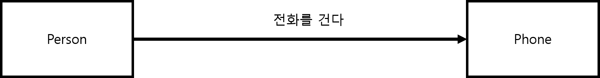
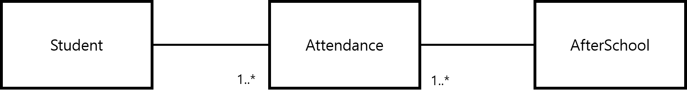
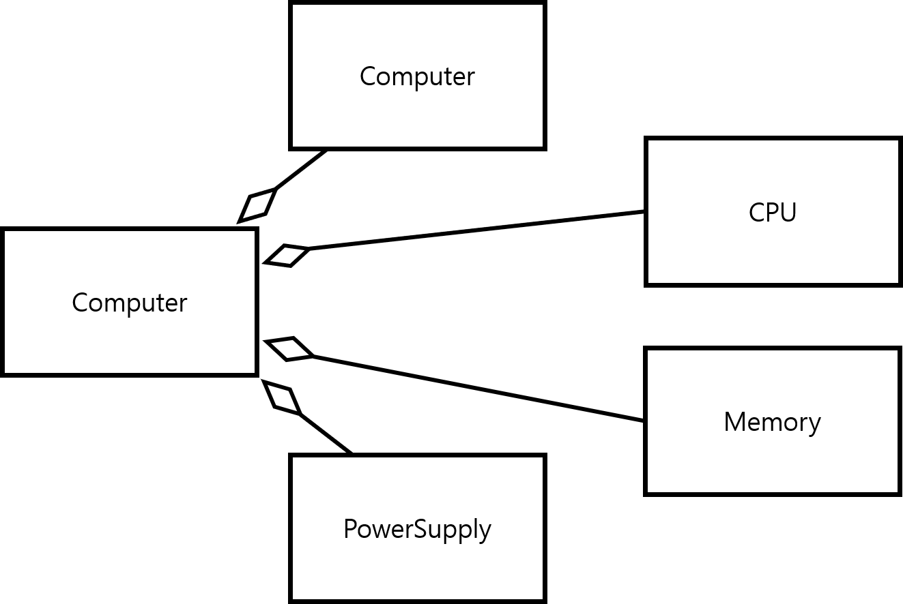

# 1. 모델링

자동차 모델이 있다. 바퀴가 몇 개이고 문이 몇개인지 또한 어떤 스타일의 자동차인지를 모델을 통해 알 수 있다.  

소프트웨어 개발에서 모델의 역할도 크게 다르지 않다. 소프트웨어 모델을 통해 서로의 해석을 공유해 합의를 이루거나  
해석의 타당성을 검토할 수 있을 뿐만 아니라 현재의 소프트웨어 시스템 또는 앞으로 개발할 소프트웨어의 원하는 모습을  
가시화하는데 도움을 주기 때문이다.

무엇보다 한 모델을 통해 소프트웨어 시스템의 구조와 행위를 명세할 수 있으며 시스템을 구축하는 틀과   
구축된 소프트웨어의 문서화 기능을 제공 할 수도 있다.

밑에는 모델의 역할을 3줄 요약 한 것이다.

모델의 역할
- 서로의 해석을 공유해 합의를 이루거나 해석의 타당성을 검토한다.
- 현재 시스템 또는 앞으로 개발할 시스템의 원하는 모습을 가시화한다.
- 시스템의 구조와 행위를 명세할 수 있으며 시스템을 구축하는 틀을 제공한다.

모델의 중요한 점은 추상화(abstraction)을 바탕을 두고 만들어져야 한다.  
추상화는 대상을 표현할 때 대상의 사세한 면을 있는 그대로 다 표현하지 않는다.  
특정 관점에서 관련이 있는 점은 강조시키고 그 반대는 무시할 필요가 있다.  

예를들면 대학교 학사 지원 업무에서 학생을 모델링 할 때 학생의 머리카락 수나 색깔은  
학사 지원과 관련이 없어 제외될 수 있지만 학생의 학번이난 수강 과목등은 학사 지원 업무에서  
중요한 요소이므로 무시하면 안된다.

# 2. UML

모델링(Modeling)을 하려면 시스템을 모델로 표현해주는 언어가 필요하다.  
대표적인 모델링 언어로 UML(Unified Modeling Language)이 있다.  
UML은 요구 분석, 시스템 설계, 시스템 구현 등의 시스템 개발 과정에서 개발자 사이의  
의사 소통이 원활하게 이루어지도록 표준화한 통합 모델링 언어다.  

이 언어는 객체 관련 표준화 기구 OMG(Object Management Group)에서  
1977년 11월 객체 모델링 기술, OOAD(Object Oriented Analysis and Design) 방법론 등 을 통합해 만들었다.

UML 2.0에서는 시스템의 구조와 동작을 표현하는 13개 다이어그램을 제공한다. 많은 다이어그램을 제공하는 이유는  
다양한 관점에서 시스템을 모델링하기 위함이다.  

# 3. 클래스 다이어그램

시스템을 구성하는 클래스들 사이의 관계를 표현한다.  
클래스 다이어그램은 시간에 따라 변하지 않는 시스템의 정적인 면을  
보여주는 대표적인 UML 구조 다이어그램이다.  

클래스 다이어그램은 시스템을 구성하는 클래스와 그들 사이의 관계를 보여준다.  
주요 구성 요소는 클래스와 관계다.

## 3-1. 클래스

클래스는 동일한 속성과 행위를 수행하는 객체의 집합이다.  
예를 들어보자. 현재 소프트웨어 개발과이고 안드로이드를 하는 학번 20110 아무개와  
같은 소프트웨워 개발과 이면서 백엔드를 하는 학번 20104 개무아가 있다고하자.  
이때 아무개와 개무아는 이름, 전공, 학번이란 공통적인 데이터를 가진다.  
따라서 아무개와 개무아는 하나의 객체로 여길 수 있다.  
혹은 '학생'이라는 집합이나 클래스의 인스턴스(실체)로도 생각 할 수 있다.  

클래스를 보는 다른 관점은 객체를 생성하는 설계도로 간주하는 것이다.  
예를들면 붕어빵 틀을 생각하면 이해 할 수 있을 것이다.  

## 3-2. 관계

클래스 하나로만 이루어지는 시스템은 존재하지 않는다.  
한 사람이 모든 일을 처리할 때보다 여러 사람이 모였을 때 일을 좀 더 효과적으로  
처리 할 수 있듯이 다수의 클래스가 모인 시스템은 훨씬 더 효율적이게 된다.  

객체지향 시스템도 여러개의 클래스가 서로 긴밀한 관계를 맺어 기능을 수행한다.    
밑에는 UML에서 제공하는 클래스들 사이의 관계를 간략하게 정리해 둔것이다.  

라벨|의미
-|-
연관 관계(association) | 클래스들이 개념상 서로 연결되었음을 나타낸다. 실선이나 화살표로 표시하며 보통은 한 클래스가 다른 클래스에서 제공하는 기능을 사용하는 상황일 때 표시한다.
일반화 관계(generalization) | 객체지향 개념에서 상속 관계라고 한다. 한 클래스가 다른 클래스를 포함하는 상위 개념일 때 이를 IS-A 관계라고 하며 UML에서는 일반화 관계로 모델링한다. 속이 빈 화살표를 사용해 표시한다.
집합 관계(composition, aggregation) | 클래스들 사이의 전체 또는 부분 같은 관계를 나타낸다. 집약(aggregation)관계와 합성(composition)관계가 존재한다.
의존 관계(dependency) | 연관 관계와 같이 한 클래스가 다른 클래스에서 제공하는 기능을 사용할 때 를 나타낸다. 차이점은 두 클래스의 관계가 한 메서드를 실행하는 동안과 같은, 매우 짧은 시간만 유지된다는 점이다. 점선 화살표를 사용해 표시한다.
실체화 관계(realization) | 책임들의 집합인 인터페이스와 이 책임들을 실제로 실현한 클래스들 사이의 관계를 나타낸다. 상속과 유사하게 빈 삼각형을 사용하며 머리에 있는 실선 대신 점선을 사용해 표시한다.

### 3-2-1. 연관 관계
두 개념이 연관되어 있을 때 UML 연관 관계를 사용하면 나타낼 수 있다.  
UML에서 연관 관계는 클래스 사이에 선을 그어 표시한다.  
예를 들어 "선생님(Teacher class)가 학생(Student class)을 가르친다." 라는 사실이 있다.  
그리고 아래 그림 처럼 선생님과 학생 클래스의 사이에 선을 긎고 선 위에'가르친다'를 적으면 연관 관계를 나타낼 수 있다.  

연관 관계는 방향성을 가질 수 있다. 밑에 그림처럼 '전화를 건다' 연관관계는 Person 이 Phone 으로 향하도록 되어 있다.    
이는 사람(Person)이 전화를 거는데 사용되는 휴대폰(Phone)을 알지만  
Phone은 자신을 사용하는 사람들의 존재를 모른다는 것이다.  
이를 단방향 연관 관계라고 한다.

반대로 위에 그림처럼 연결한 선에 화살표를 사용하지 않고 있다는 것을 알 수 있다.  
이는 두 클래스의 객체들이 서로의 존재를 인식한다는 것이고  
이 연관 관계를 양방향 연관 관계 라고 한다.

연관 관계에는 다중성이라는 것이 있다. 설명을 하기 위해 예를 들어보겠다.  
학생이 방과후를 신청한다고 하자. 학생은 일반적으로 다양한 방과후를 신청하게된다.  

그리고 위에 그림처럼 연관 관계를 표현하게 되면 한명의 학생이 한 개의 방과후만 신청한다는 상태가 되버리고 만다.  
그래서 한 명의 학생이 여러개의 방과후를 신청한다는 것을 표현하기 위해 연관된 객체(Student 객체) 수를  
연관된 AfterSchool 클래스와 연결한 선 부근에 명시한다. 이를 다중성 이라고 한다.  

여러 가지 형태의 다중성 표시는 밑에 표와 같이 한다.

다중성 표시|의미
-|-
1 | 엄밀하게 1
\* | 0또는 그 이상
0..* | 0 또는 그 이상
1..* | 1 이상
0..1 | 0 또는 1
2..5 | 2 또는 3 또는 4 또는 5
1, 2, 6 | 1 또는 2 또는 6
1, 3..5 | 1 또는 3 또는 5

이제 위에 Student 와 AfterSchool 의 관계를 다중화를 이용하여 다시 표현하면 아래 그림과 같다.  

그러나 위에 그림 처럼 표현하면 이상한 관계가 된다. 왜냐하면 한 방과후에 한 명의 학생만 수강해야 한다는 뜻이 되버리기 떄문이다.  
이를 여려 명의 학생이 수강할 수 있는 일반적인 신청 관계를 개선하려면 밑에 그림 처럼 다중성을 수정 해야한다.

다중성을 수정하면서 단방향 연관 관계가 양뱡향 연관 관계로 바뀌었다.   
다대다 연관 관계는 자연스럽게 양방향 연관 관계가 되므로 구현하기가 생각보다 복잡하다.  
그래서 일대다 단방향 연관 관계로 변환해 구현해야 한다.  
먼저 단방형 연관 관계로 변환하기 전에 연관 클래스(association class)를 알아두는 것이 좋다.  

만약 위에 그림에서 출석 일수를 추가하게 되면 어디에 두어야 할까?  
아마 Student 나 AfterSchool에 두어야 할지 생각할 것이다. 하지만 둘다 어디에도 둘 수 없다.   
출석 일수 같은 정보는 Student 와 AfterSchool 두 클래스 객체가 존재해야만 의미 있는 정보가 되기 때문이다.  

좀 더 이 문제를 설명하면 '아무개 학생이 30일 동안 나왔다.' 라는 말은 어색할 수 있다.  
어떤 방과후에서 30일 동안 나왔는지 정보가 누락되기 때문이다.  

'아무개 학생이 JAVA 프로그래밍 방과후 수업에서 30일 동안 나왔다' 라고 할 때만 의미가 통하게 된다. 

즉, 출석 정보는 클래스의 속성이 아닌 '신청하다'라는 연관 관계의 속성으로 다뤄야 한다.  
이때 연관 클래스를 사용하면 된다.  

연관 클래스는 연관 관계에 추가할 속성이나 행위가 있을 때 사용한다.  

위 그림처럼 연관 관계가 있는 두 클래스 사이에 위치하며,  
연관 관계를 나타내려고 연결선 중앙에서 연관 클래스까지 점선을 사용해 연결한다.  

그럼 연관 클래스는 어떻게 구현해야 할까?  
먼저 아래에 연관 클래스에서 우리가 원하는 정보가 어떠한 형태인지 예가 있다.  

* '아무개 학생이 JAVA 프로그래밍 방과후 수업에서 30일 동안 나왔다'

위 예에서 Student 클래스와 AfterSchool 클래스, Attendance(출석) 클래스를 추출할 수 있다.  
Attendance 객체는 Student 객체와 AfterSchool 객체를 연관시키는 객체이므로  
Student 객체와 AfterSchool 객체를 참조할 수 있는 속성을 포함해야 한다.  
그리고 출석 일수 같은 데이터는 Student 클래스나 Course 클래스에 속하지 않으며  
두 클래스의 연관 정보이므로 이들도 Attendance 클래스의 속성이어야 한다.

여기서 학생 입자엥서는 여러 방과후를 신청하여 각 방과후들의 출석 일수가 생길 수 있고  
마찬가지로 한 방과후에서도 여러가지 출석 일수가 생긴다.

다시말해 Student 클래스와 Attendance 클래스의 연관 관계의 다중성은 일대다이며  
또한 AfterSchool 클래스와 Attendance 클래스의 다중성도 일대가 된다.

이를 기반으로 밑에 처럼 다시 표현한 것이다.

그런데 같은 학생 같은 방과후를 여러 번 수강할 수도 있는 만큼 주어진 학생과 방과후에  
여러개의 출석 정보가 연관 될 수 있다. 따라서 이러한 이력이 모두 온전하게 표현하려면  
아래 그림 처럼 표현하면 된다.

위와 같은  클래스 다이어그램으로, 클래스 이름 아랫부분에 어떤 연관 관계의 이력(history)을 작성하면 된다.

연관 관계는 떄로는 재귀적(reflexive)일 수 있다.  
재귀적 연관 관계란 동일한 클래스에 속한 객체를 사이의 관계다.  
예를 들어 직원이라는 클래스를 생각해보자.  
직원들 중에는 관리자 역할을 하는 직원도 있고 사원 역할을 하는 직원도 있다.  

간단하게 모델링하면 위에 그림처럼 될 것이다.  
그런데 따지고 보면 관리자 한 명이 여려 명의 사원들을 관리한다.  
그리고 관리해야 하는 사원이 전혀 없는 관리자가 있을 수도 있다.  
반대로 어떤 사원은 관리자가 없을 수도 있다.  
여기서 문제점들이 발생한다.  

만약 '아무개' 관리자가 '개무아' 사원을 관리한다고 하자.  
그런데 '개무아'도 '개개무' 사원 관리하는 관리자라면 '개무아'는 사원이라는 객체는  
'관리자'와 '사원'이라는 두 클래스에 동시에 속하는 모순이 발생하고 만다.  

다시말해 '관리자'와 '사원' 역할을 클래스로 만들면 시스템이 변화할 때 유연성이 부족할 수 있으므로 가급적 역할을 클래스로 만들지 않는 것이 좋다.  
그래서 재귀적 연관 관계가 생겨난 것이다. 

위 그림처럼 재귀적 연관 관계로 모델링할 수 있다. 하지만 문제점이 아직 하나 남았다.  
만약 '아무개'가 '개무아'를 관리하고 '개무아'가 '개개무'를 관리하는 상황에서  
'개개무'가 '아무개'를 관리하는 상황이 있을 수도 있기 때문이다.  
이를 '관계의 루프'라고 하는데, 이런 상황을 배제해야한다.  

그래서 위 그림처럼 연관 관계에 제약을 설정해야 한다.  
제약은 '{ }' 안에 미리 정해진 제약뿐만 아니라 어떤 문장도 자유롭게 쓸 수 있으며,    
클래스나 연관 관계를 포함한 UML 모델 요소가 따라야 하는 규칙을 붙여줄 때 사용한다.   
위 그림에서는 '{Tier(계층)}' 이라는 제약을 설정했다.  
'{Tier}'는 객체 사이에 상하 관계가 존재하고 사이클이 존재하지 않는다는 의미이다. 

### 3-2-2. 일반화 관계

한 클래스가 다른 클래스를 포함하는 상위 개념일 때 두 클래스 사이에는 일반화 관계가 존재한다.  
일반화 관계가 있을 때 자식(서브 클래스)이라 불리는 클래스는 부모(슈퍼 클래스)라 불리는 클래스로부터  
속성과 연산을 물려받을 수 있다. 이는 객체지향 개념에서는 일반화 관계를 상속 관계라고 한다.

예를들어 가전 제품과 냉장고 사이의 관계 혹은 TV, 전자레인지와 가전 제품의 관계는 모든 가전 제품과  
'is a kind of 관계'다.

* '냉장고' is a kind of '가전제품' ('냉장고'는 '가전제품'의 한 종류다.)
* 'TV' is a kind of '가전제품' ('TV'는 '가전제품'의 한 종류다.)
* '전자레인지' is a kind of '가전제품' ('전자레인지'는 '가전제품'의 한 종류다.)

그리고 가전 제품을 부모 클래스라 하며 냉장고, TV, 전자렝니지를 자식 클래스라고 한다.

UML에서 일반화 관계는 두 클래스를 연결하는 화살표의 끝에 빈삼각형 표시를 해 표현한다.  
삼각형 표시가 있는 쪽은 부모 클래스, 반대쪽은 자식 클래스를 나타낸다.  
아래 그림 처럼 표현 된다.

가전 제품은 냉장고, TV, 전자레인지의 공통 속성이나 연산을 제공하는 틀로도 생각할 수 있다.  
예를들어 모두 제조년도, 제조회사와 같은 공통 속성을 지녔고, turnOn, turnOff와 같은  
연산이 제공된다면 이와 같은 속성이나 연산은 가전 제품 클래스에 두고 상속 받으면 된다.

그러나 turnOn 이나 turnOff 같은 연산의 구현은 냉장고, TV, 전자레인지마다 다르다는 점이 있다.  
따라서 turnOn과 turnOff 연산의 제공을 제공하지 않고 자식 클래스에 정의하게 할 필요가 있다.  
이때 부모 클래스인 가전 제품 클래스에 구현되지 않은 빈 껍데기만 있는 연산을 추상 메서드라 한다.

추상 메서드를 하나 이상 가지는 클래스를 추상 클래스라고 하며, 이는 다른 일반적인 클래스와는 달리 객체를 생성할 수 없다.

UML 에서는 추상 클래스와 메서드를 이탤릭체로 써서 구분하거나  
스테레오 타입(streotype : '<<', '>>' 기호 안에 원하는 이름을 넣음) 으로 표시한다.

### 3-2-3. 집합 관계

집합 관계는 UML 연관 관계의 특별 경우다. 전체와 부분의 관계를 명확하게 명시하고자 할 때 사용한다.  
집약(aggregation)과 합성(composition) 두 종류의 집합 관계가 존재한다.  

합성 관계는 아래 그림 처럼 전체를 가리키는 클래스 방향에 채워진 마름모로 표시되며 부분 객체가 전체 객체에 속하는 관계다.  

 

이는 전체 객체가 사라지면 부분 객체도 사라지는 경우를 의미한다.  
공유 할 수 잇는 객체를 사용할 경우는 합성 관계가 아닌 집약 관계를 사용한다.  
이때 부분 객체의 라이프 타임은 전체 객체의 라이프타임에 의존한다.  
결국 전체 객체가 없어지면 객체도 없어진다.

집약 관계는 한 객체가 다른 객체를 포함하는 것을 나타낸다. '전체', '부분'과의 관계며 '전체'를 가리키는 클래스 방향에  
빈 마름모로 표시한다. 밑에 그림처럼 표현한다. 

 

특히 부분을 나타내는 객체를 다른 객체와 공유할 수 잇는 경우에 집약 관계로 나타낸다.  
여기서 전체 객체의 라이프타임과 부분 객체의 라이프타임은 독립적이다.  

즉, 전체 객체가 메모리에 사라져도 부분 객체는 사라지지 않는다.

이제부터 집약 관계와 합성 관계의 구분을 위해 밑에 있는 코드들을 표현하는 클래스 다이어그램을 작성해보자. 

<pre>
public class Computer {
    private MainBoard mb;
    private CPU c;
    private Memory m;
    private PowerSupply ps;
    
    public Computer(){
        this.mb = new MainBoard();
        this.c = new CPU();
        this.m = new Memory();
        this.ps = new PowerSupply();
    }
}
</pre>

이 코드에서 주목할 점은 생성자가 컴퓨터의 부품이 되는 객체들을 생성해 적절한 속성에 바인딩한다는 점이다.  
즉, c1 = new Computer() 으로 Computer 객체가 생성되면 c1의 부품을 이루는 Mainboard 객체, CPU 객체, Memory 객체,  
PowerSupply 객체가 생성된다. 그리고 c1이 사라지면 부품 객체들도 같이 사라진다.  
이는 부품 객체들의 라이프타임이 Computer 객체의 라이프타임에 의존하는 관계가 형성된다.  
결국 합성 관계로 아래 그림철머 모델링하면 된다.

 

<pre>
public class Computer {
    private MainBoard mb;
    private CPU c;
    private Memory m;
    private PowerSupply ps;
    
    public Computer(){
        this.mb = new MainBoard();
        this.c = new CPU();
        this.m = new Memory();
        this.ps = new PowerSupply();
    }
}
</pre>

위 코드는 Computer 객체가 사라져도 부품을 구성하는 Mainboard 객체, CPU 객체, Memory 객체, PowerSupply 객체가  
사라지지 않는다. 외부에서 이들 객체에 대한 참조만 받아 사용했기 때문이다.  
즉, 전체를 표현하는 Computer 객체의 라이프타임과 부분 객체의 라이프타임은 무관하다.  
따라서 집약 관계를 사용하여 아래 그림처럼 모델링하는 것이 적당하다.

 
